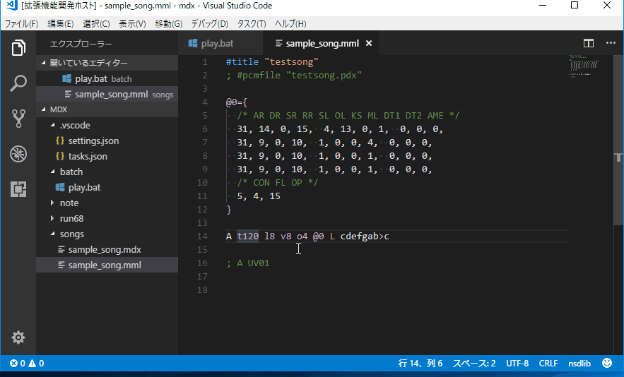

# watch-run README

## Features

This extension will watch specified file and run the task when that is changed. 



## Extension Settings Example

**Note:** If you change settings.json, call "Apply settings" from the menu.

* `(project root)/.vscode/settings.json` : list of target items.

```
{
    // If you change settings.json, call "Apply settings" from the menu.
    "watch-run.targetList": [
        {
            "target": "**/*.txt",
            "task": "show_filename"
        },
        {
            "target": "/index.html",
            "task": "show_html"
        },
        {
            "target": "/js/*.js",
            "task": "run_js"
        },
        {
            "regexp": "index-\\d+.html",
            "task": "show_index_number_html"
        }
    ]
}
```
## tasks.json settings example

* `(project root)/.vscode/tasks.json` : Write tasks here. usually generated from Configure Tasks menu.  
```
{
    // See https://go.microsoft.com/fwlink/?LinkId=733558
    // for the documentation about the tasks.json format
    "version": "2.0.0",
    "tasks": [
        {
            "label": "show_html",
            "type": "shell",
            "command": "start ${file}"
        },
        {
            "label": "show_filename",
            "type": "shell",
            "command": "echo \"File:${file}\""
        },
        {
            "label": "run_js",
            "type": "shell",
            "command": "node ${file}"
        },
        {
            "label": "show_index_number_html",
            "type": "shell",
            "command": "start ${file}"
        }
    ]
}
```

## How work this example?

* edit somewhere_dir/something.txt
 show filename in console from the task labeled "show_filename".

* edit (workspace_root)/js/something.js
 run JavaScript on node command in the task labeled "run_js".

* edit (workspace_root)/index.html
 run the task labeled "show_filename" to open index.html in browser.(in Windows)

* edit somewhere_dir/index-1234.html
* edit somewhere_dir/index-256.html
 open index-{number}.html in browser (in Windows)

## Release Notes

### 0.4.1
* Improved activation events.
* Removed unnecessary file.

### 0.4.0
* Added "Apply Setting" to Menu.
* Added "regexp" field to Setting.
* Fixed that glob pattern doesn't work properly.
 
### 0.3.0
* Changed watch library to node-watch.

### 0.2.5
* Added multi-root support.
* Added internal command support.

### 0.2.2
* Fixed a bug of ignoring directory/file which starts with dot.

### 0.2.1
* Added Example.

### 0.2.0
* Updated package.

### 0.0.2
* Added description.

### 0.0.1
* Initial release.
