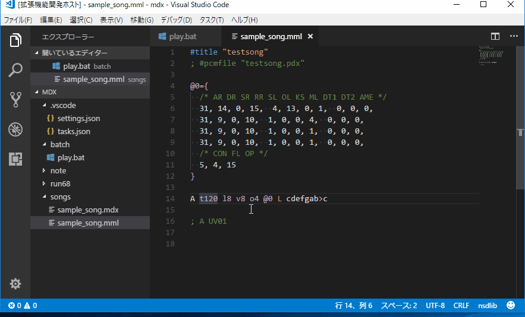

# watch-run

`watch-run` は、ワークスペース内のファイル変更を監視し、変更されたファイルに対応する VS Code task を実行する拡張機能です。

ファイルの種類ごとに実行する task を割り当てられます。
変更されたファイルのパスを task へ渡すこともできます。



## 必要な環境

- VS Code 1.107 以降
- フォルダーまたはワークスペースを開いた状態
- 実行する task を `.vscode/tasks.json` に定義できること

## インストール

VS Code の拡張機能ビューで `watch-run` を検索してインストールします。

拡張機能を有効にした後、監視対象と実行する task を設定します。

## 基本設定

ワークスペースの `.vscode/settings.json` に `watch-run.targetList` を追加します。

```jsonc
{
    "watch-run.targetList": [
        {
            "target": "**/*.txt",
            "task": "show_filename"
        },
        {
            "target": "/js/*.js",
            "task": "run_js"
        },
        {
            "regexp": "index-\\d+\\.html",
            "task": "open_html"
        }
    ]
}
```

各項目には次のプロパティを指定します。

| プロパティ | 必須 | 説明 |
| --- | --- | --- |
| `target` | どちらか一方 | glob パターンで監視対象を指定します。 |
| `regexp` | どちらか一方 | JavaScript の正規表現で監視対象を指定します。大文字と小文字は区別しません。 |
| `task` | 必須 | 変更時に実行する task の `label` を指定します。 |

`target` と `regexp` を両方指定した場合は、`target` が使われます。
`target` には `glob-to-regexp` が解釈できる glob パターンを指定します。

パスはワークスペースルートからの相対パスを使って照合します。
先頭に `/` が付くため、ルート直下のファイルや特定のディレクトリを指定するときは、`/index.html` や `/js/*.js` のように書きます。
`**/*.txt` のようなパターンは、ワークスペース内の任意の階層にある `.txt` ファイルに一致します。

## task の定義

実行する task は `.vscode/tasks.json` に定義します。
`watch-run.targetList[].task` の値と、task の `label` は完全に一致させてください。

次の例では、テキストファイルの変更時にファイル名を表示し、JavaScript ファイルの変更時に Node.js で実行します。

```jsonc
{
    "version": "2.0.0",
    "tasks": [
        {
            "label": "show_filename",
            "type": "shell",
            "command": "echo File: ${input:show_filename_file}",
            "problemMatcher": []
        },
        {
            "label": "run_js",
            "type": "shell",
            "command": "node ${input:run_js_file}",
            "problemMatcher": []
        }
    ],
    "inputs": [
        {
            "id": "show_filename_file",
            "type": "command",
            "command": "watch-run.getFilename",
            "args": "show_filename"
        },
        {
            "id": "run_js_file",
            "type": "command",
            "command": "watch-run.getFilename",
            "args": "run_js"
        }
    ]
}
```

`inputs[].args` には、パスを取得したい task の `label` を指定します。
その task が監視対象に一致した後であれば、`${input:...}` を使って変更されたファイルのパスを取得できます。

## 設定を反映する

`settings.json` の `watch-run.targetList` を変更したら、コマンドパレットから `watch-run: Apply Settings` を実行します。

このコマンドは現在の監視を停止し、設定を読み直して監視を開始します。
設定変更後に実行しないと、変更前の監視条件が使われ続けます。

## 変更されたファイルの情報を取得する

task の `inputs` から、次の command を呼び出せます。

| command | 取得する値 |
| --- | --- |
| `watch-run.getFilename` | 変更されたファイルのパス |
| `watch-run.getDirname` | 変更されたファイルがあるディレクトリのパス |
| `watch-run.getBasename` | ファイル名と拡張子。例：`file.ext` |
| `watch-run.getExtname` | 拡張子。例：`.ext` |
| `watch-run.getFilenameWithoutExtension` | 拡張子を除いたファイル名。例：`file` |

各 command は task の `label` を引数に取ります。
引数に指定した task がまだ一度もファイル変更を検出していない場合、値は取得できません。

## よく使う設定例

### 特定の拡張子を監視する

```jsonc
{
    "watch-run.targetList": [
        {
            "target": "**/*.html",
            "task": "open_html"
        }
    ]
}
```

### 特定のディレクトリを監視する

```jsonc
{
    "watch-run.targetList": [
        {
            "target": "/scripts/*.js",
            "task": "run_js"
        }
    ]
}
```

### 正規表現で連番ファイルを監視する

```jsonc
{
    "watch-run.targetList": [
        {
            "regexp": "index-\\d+\\.html",
            "task": "open_html"
        }
    ]
}
```

正規表現は変更されたパス全体に対して評価されます。
`index-1234.html` のようにファイル名の一部を照合する場合は、上の例のようにファイル名だけを指定できます。

## 複数フォルダーのワークスペース

マルチルートワークスペースでは、すべてのワークスペースフォルダーを監視します。

同じ task の `label` を複数のフォルダーで使うと、その task に対して最後に検出したファイルのパスが保持されます。
フォルダーごとに変更ファイルを区別したい場合は、task の `label` を分けてください。

## 注意点

- 監視対象に一致した変更イベントごとに task を実行します。task の実行中に追加の変更が発生した場合も、イベントは自動的にはまとめられません。
- `target` の glob は大文字と小文字を区別します。
- `regexp` は大文字と小文字を区別しません。
- `task` に指定した task が存在しない場合、VS Code は task を実行できません。
- task の shell command は、通常の VS Code task と同じ権限と環境で実行されます。

## 開発

```bash
npm install
npm run compile
npm run lint
npm test
```

## リリース履歴

[CHANGELOG.md](CHANGELOG.md)
